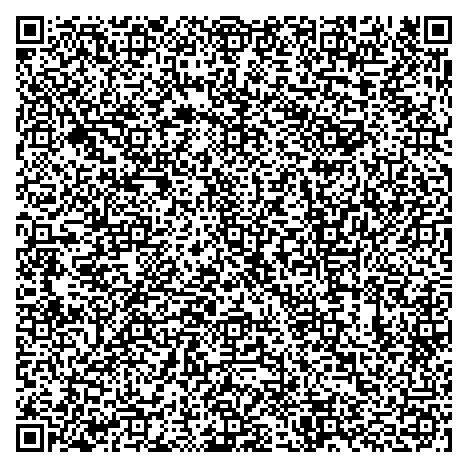

### Local transportation

We recommend that you use the app _moovit_ to obtain information about local public transport. See [here](https://moovitapp.com/puerto_madryn-6141/poi/3051%20Bv.%20Almirante%20Brown/Hotel%20Bah%C3%ADa%20Nueva/es-419?ref=5&customerId=4908&fll=-42.76449_-65.034777&tll=-42.785873_-65.005766&t=1) for routes from _Hotel Bahía Nueva_ to the university campus, or scan the following QR code (opens in _moovit_ app):

 

 

### Where will the event take place?

The event will take place in Puerto Madryn, Argentina, at the campus of 
[Universidad Nacional de la Patagonia _San Juan Bosco_](https://madryn.unp.edu.ar/), 
located at [Bv. Almte Brown 3051, U9120 Puerto Madryn, Chubut, Argentina](https://goo.gl/maps/cyTsYQmtWefDwCAB8).

Due to the way air traffic is organized in the country, if you are arriving 
from abroad, for example from Europe or North America, you will have to first 
get to the city of Buenos Aires through the *Ezeiza* airport, and then take a 
short flight south, to Puerto Madryn, from the *Aeroparque* airport. Please 
continue reading below for more details.

### Information about airports and local shuttles

The main __international__ airport is the _Aeropuerto Internacional de Ezeiza_ (known 
as _Ezeiza_). Official
information about this airport is available [here](https://www.aa2000.com.ar/ezeiza),
unofficial but otherwise useful information in English is available [here](https://www.buenos-aires-airport.com/ezeiza/) and [here](https://aeropuertoezeiza.net/en).

The main airport for local flights out of Buenos Aires is the _Aeroparque Metropolitano Jorge Newbery_ (known as _Aeroparque_). There is a 45 minutes express bus service offered by [_Manuel Tienda León_](https://www.tiendaleon.com/) with a frequency of 30 minutes that connects the Ezeiza airport with the Puerto Madero terminal in the city center and also with the Aeroparque airport for domestic flights.  

To get from Aeroparque to Puerto Madryn, there are at least two options:

1. Go to _Aeropuerto Tehuelche_, about 10 km away from Puerto Madryn.

2. Go to [_Aeropuerto Almirante Marcos A. Zar_](https://www.aeropuertotrelew.com/en/index.php), about 60 km away from Puerto Madryn near the city of Trelew. 

The second option has a higher flight frequency and is preferred by tourists, since flights into Puerto Madryn are restricted as a result of environmental concerns. The 50km distance difference can be made up for by using the [door-to-door shuttle service to Puerto Madryn](https://transferpmy.com/).

<!-- 
<em>More information coming soon!</em>
 -->

### About Puerto Madryn

[Puerto Madryn](https://en.wikipedia.org/wiki/Puerto_Madryn) is located in the northeast of the Chubut province in Argentina,
facing the Argentine sea and the Atlantic Ocean. It is a few kilometers away from
the [_Valdés peninsula_](https://en.wikipedia.org/wiki/Valdes_Peninsula), declared World Heritage Site by UNESCO in 1999. You can find official information, including maps and useful .pdf files [here](https://madryn.travel/en/), and as usual get information from [Trip Advisor](https://www.tripadvisor.com/Tourism-g312832-Puerto_Madryn_Province_of_Chubut_Patagonia-Vacations.html).

