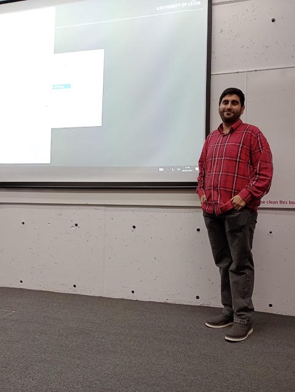

[Karin Baur](http://www1.maths.leeds.ac.uk/~pmtkb/) (University of Leeds)
_Cluster algebras and cluster categories via surfaces._ Twenty years of research in cluster theory have established deep links between cluster algebras, surface geometry and representation theory. Cluster structures can be defined using surface geometry, with curves corresponding to cluster variables and to rigid objects in associated categories. The classical Ptolemy relations give rise to exchange phenomena or mutation in the associated cluster structures. In these lectures I will focus on the geometric approach to cluster algebras and cluster categories. Topics discussed will include cluster structures on the Grassmannian, friezes, laminations, Postnikov diagrams, dimer models, root combinatorics.

### Assistants ###

_Juan Pablo Maldonado_ will be the assistant to Kairin Baur for this course's tutorials.

Juan is a Ph.D  student based in the _Universidad Nacional de Mar del Plata_ under the advisory of Karin Baur (University of Leeds) and Ana García Elsener (Universidad Nacional de Mar del Plata). His research interest are combinatorics, cluster algebras, dimer models and Jacobian algebras, among others.

 

 

### Reading material for the course ###

1. [_Grassmannians and cluster structures_.](baur/baur-lecture-notes.pdf)