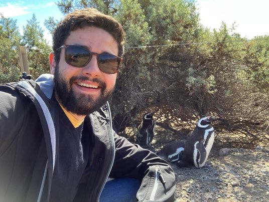

[Najib Idrissi](https://idrissi.eu) (Universite de Paris)
_Configuration spaces, algebraic topology and operads._ 
I plan to explain how two classical objects in algebraic topology are related: configuration spaces, and operads. Configuration spaces, on the one hand, consist in collections of pairwise distinct points in a given manifold. The study of these spaces is a classical problem in algebraic topology. Operads, on the other hand, are algebraic objects whose representations are categories of algebras (e.g., associative algebras, commutative algebras, or Lie algebras). The intimate relationship between these two objects comes in the form of the little disks operads, a certain family of operads which is central in many applications and which involves the configuration spaces of the Euclidean spaces. I will show how ideas that come from the theory of operads --- namely, the proof of the formality of the little disks operads --- is useful in order to settle the question of the rational homotopy invariance of configuration spaces.

More detailed information can be found in the [speaker's website](https://idrissi.eu/class/23-cimpa).

### Assistants ###

_Victor Roca i Lucio_ will be the assistant to David Jordan for this course's tutorials.

Victor is a postdoc at Ecole Fédérerale Polytechnique de Lausanne (EPFL) in Switzerland. He completed his PhD
in 2022 at the Université Sorbonne Paris Nord under the supervision of Bruno Vallette. His research interests 
are algebraic operads, homotopical algebra, rational homotopy, deformation theory and penguins.

 

 

### References ###

(1) Fresse, Benoit. _Homotopy of Operads and Grothendieck–Teichmüller Groups Part 1: The Algebraic Theory and its Topological Background_. Mathematical Surveys and Monographs Volume 217, AMS. (Parts Ia y Ib).

(2) Idrissi, Najib. [_Real Homotopy of Configuration Spaces_](https://hal.science/hal-03821309v1/document), Peccot Lecture, Collège de France, March and May 2020. _Springer International Publishing_, __2303__, 2022, _Lecture Notes in Mathematics_, `10.1007/978-3-031-04428-1`.
