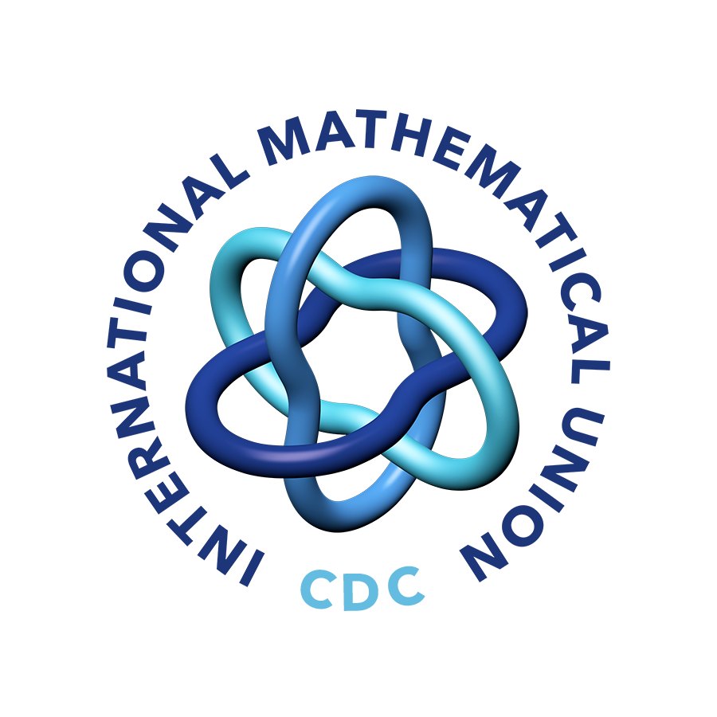

The [CIMPA School](https://www.cimpa.info/en/node/9) _Crossroads of geometry, representation theory and higher structures_ will take place from March 13th to March 26th 2023 in Puerto Madryn, Argentina, at the campus of [Universidad Nacional de la Patagonia _San Juan Bosco_](http://www.unp.edu.ar). 

### News

Registration is now open! Please go to the [registration](https://crossroads-2023.github.io/register.html) tab for details. CIMPA registration is now also open, and is mandatory for all participants. Please go to [this link](https://www.cimpa.info/en/node/40) for more information.

### Poster

You can download (and print) a high quality version of the school's poster at [this link](CIMPA23poster.pdf).

### Sponsors

We gratefully acknowledge support from the following sponsors. We are supported by a grant from the IMU-CDC [_Conference Support Program_](https://www.mathunion.org/cdc/grants/conference-support-program), which is partially supported by the [Abel Board](https://abelprize.no/node/154).

<a href="https://www.hu-berlin.de/en"> &nbsp;&nbsp;&nbsp;
<a href="https://compositio.nl/#foundation"> &nbsp;&nbsp;&nbsp;
<a href="https://www.conicet.gov.ar/conicet-descripcion/">  
<a href="https://www.mathunion.org/cdc"> 

