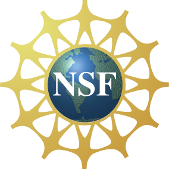

The [CIMPA School](https://www.cimpa.info/en/node/9) _Crossroads of geometry, representation theory and higher structures_ will take place from March 13th to March 24th 2023 in Puerto Madryn, Argentina, at the campus of [Universidad Nacional de la Patagonia _San Juan Bosco_](https://madryn.unp.edu.ar/). 

### News

1. The outreach talk of [Marilina Carena](https://sites.google.com/view/marilina-carena)
(Universidad Nacional del Litoral) will take place at 18:00 on Wednesday 22nd at the _Aula Magna_ of the university. 

1. [Mario Sánchez](https://sites.google.com/view/sanchezmario) will give a course during the second week of the school. Unfortunately, Federico Ardila had to cancel his participation 
in the school.

2. [Ana García Elsener](https://sites.google.com/view/ana-garcia-elsener) (Universidad Nacional de Mar del Plata) and [Gastón García](https://www.mate.unlp.edu.ar/~ggarcia/) (Universidad Nacional de La Plata) will give short research talks during the school. You can find the title
and abstract for Ana García Elsener's talk [here](elsener.md). 

_More information coming soon!_

### Poster

You can download (and print) a high quality version of the school's poster at [this link](CIMPA23poster.pdf).

### Sponsors

We gratefully acknowledge support from the following sponsors. We are supported by a grant from the IMU-CDC [_Conference Support Program_](https://www.mathunion.org/cdc/grants/conference-support-program), which is partially supported by the [Abel Board](https://abelprize.no/node/154). We also acknowledge support from an NSF grant of [Julia Pevtsova](https://sites.math.washington.edu/~julia/) and [Ralf Schiffler](https://schiffler.math.uconn.edu/).

&nbsp;&nbsp;&nbsp;
&nbsp;&nbsp;&nbsp;
 

