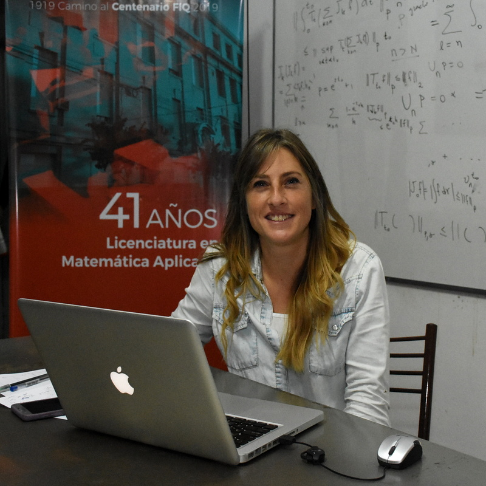
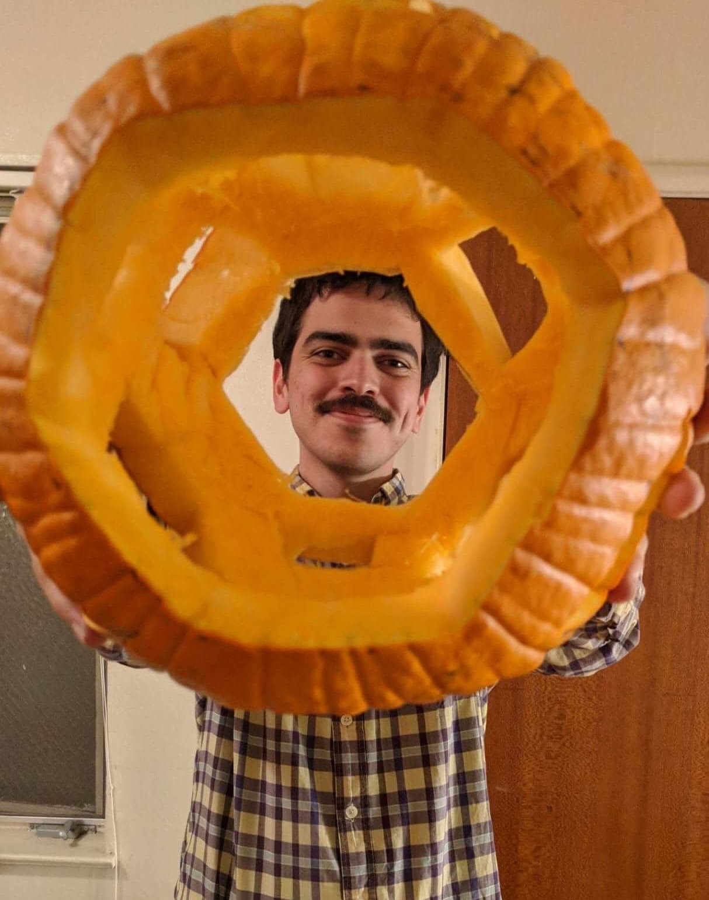

<h4>Cluster algebras and cluster categories via surfaces</h4>

    

        
    

    
    
        

            <a href="http://www1.maths.leeds.ac.uk/~pmtkb/">Karin Baur </a> is a professor in Pure Mathematics at the University of Leeds. After obtaining her PhD in 2002 from the University of Basel in Switzerland she spent her post-doctoral years at ETH, at UCSD and at the University of Leicester before being an SNSF professor at ETH. She became a full professor at the University of Graz in 2011. Her research interests lie in algebraic, combinatorial and geometric methods in representation theory. <em>Photo by Severin Nowacki</em>.
        
   
        
  
            <a href="baur.html">View mini-course details.</a>
        
   
    

<h4>A challenge to intuition</h4>

    

        
    

    
    
        

            <a href="https://sites.google.com/view/marilina-carena">Marilina Carena</a> is an
            associate professor at the School of Chemical Engineering of the Universidad Nacional del Litoral, in Santa Fé, Argentina, and an Independent Researcher of CONICET. Her research areas are mathematical analysis and geometric measure theory.  She actively participates in outreach activities and is the author of the book <a href="https://www.unl.edu.ar/editorial/index.php?act=showPublicacion&id=8155">La pelota siempre al 10</a>, in which high school mathematical concepts are explored and worked on through problems related to football.
            
   
        
  
            <a href="carena.html">View mini-course details.</a>
        
   
    

<h4>Configurations spaces, algebraic topology and operads</h4>

    

        
    

    
    
        

            <a href="https://idrissi.eu/">Najib Idrissi</a> is a maître de conférences at Université Paris Cité since 2018. He obtained his PhD in mathematics from the Université de Lille in 2017 under the direction of Benoit Fresse and worked as a postdoc at ETH Zurich in 2018 under Thomas Willwacher. He is mainly interested in operads, whether algebraic or topological, and their applications to the computation of invariants of manifolds and their configuration spaces through the theory of graph complexes. In 2020, he was awarded the Peccot <a href="https://idrissi.eu/research/peccot">Lecture</a> and <a href="https://www.college-de-france.fr/site/cours-peccot/guestlecturer-2020-03-04-11h00.htm">Prize</a> by the Collège de France and lectured on the real homotopy type of configuration spaces.
        
   
        
  
            <a href="idrissi.html">View mini-course details.</a>
        
   
    

<h4>An introduction to geometric representation theory for quantum groups</h4>

    

        
    

    
    
        

            <a href="https://www.maths.ed.ac.uk/~djordan/">David Jordan</a>
            is a Reader in the Hodge Institute at the University of Edinburgh School of Mathematics.  He received his PhD from MIT in 2011, followed by an NSF postdoctoral research fellowship at the University of Texas before joining the University of Edinburgh as a Chancellor’s fellow in 2013.  In 2015 he was awarded an ERC Starting Grant to study the <a href="https://cordis.europa.eu/project/id/637618">quantum geometric Langlands topological field theory</a>.  His work centers on quantum topology of 2-, 3-, and 4-dimensional manifolds, combining tools from higher algebra, representation theory of quantum groups, and elements of skein theory.  With his collaborators he has developed the mathematical foundation for the Betti quantum geometric Langlands TFT, a model for the Kapustin–Witten twist of N=4 SUSY Yang–Mills gauge theory.
        
   
        
  
            <a href="jordan.html">View mini-course details.</a>
        
   
    

<h4>Representation theory and categorification</h4>

    

        
    

    
    
        

            <a href="https://nicolaslibedinsky.cl/about-me/">Nicolás Libedinsky</a> is a Chilean mathematician. He studied in École Normale Supérieure in Paris and then completed his Ph.D. between Paris Diderot University and Oxford University in 2008. He had an Alexander von Humboldt postdoctoral position in Germany and is now a Professor at the Universidad de Chile. His main interest is (modular) representation theory. In 2019 he published a "mathematical novel" called <em>La unidad de todas las cosas</em>. 
        
   
        
  
            <a href="libedinsky.html">View mini-course details.</a>
        
   
    

<h4>Matroids, combinatorics, and geometry</h4>

    

        
    

    
    
        

            <a href="https://sites.google.com/view/sanchezmario">Mario Sánchez</a>
            is a National Science Foundation Postdoctoral Fellow at Cornell University. He obtained his Ph.D from the University of California, Berkeley in 2021. His research interests lie in the intersection of combinatorics with fields in algebra such as representation theory, algebraic geometry, and Lie theory. He loves the permutahedron and any math related to it.
        
   
        
  
            <a href="sanchez.html">View mini-course details.</a>
        
   
    

<h4>Computational algebra: groups, rings and combinatorics</h4>

    

        
    

    
    
        

            <a href="https://vendramin.github.io/">Leandro Vendramin</a> obtained his Ph.D. in 2010 from Universidad de Buenos Aires. Vendramin's research interests are related to non-commutative algebra. He obtained an Alexander von Humboldt Fellowship and worked as a postdoctoral fellow in the University of Edinburgh.
        
   
        
  
            <a href="vendramin.html">View mini-course details.</a>
        
   
    

