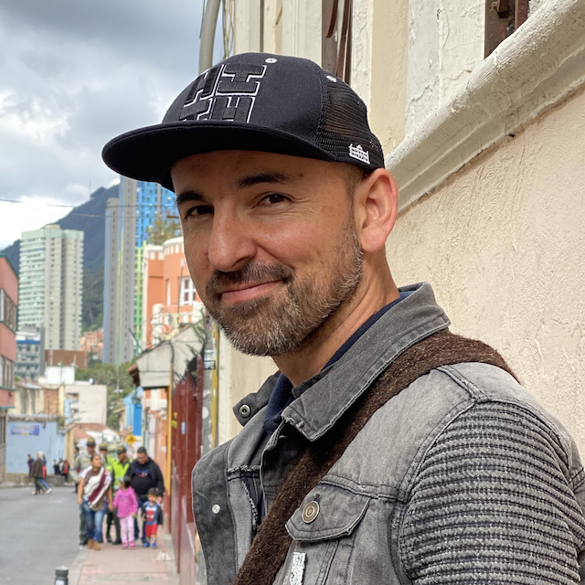
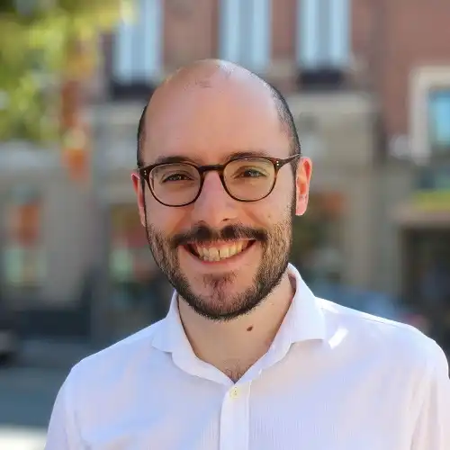
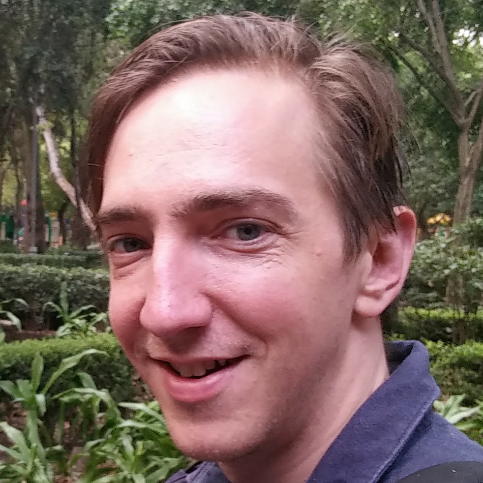
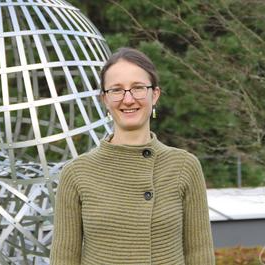
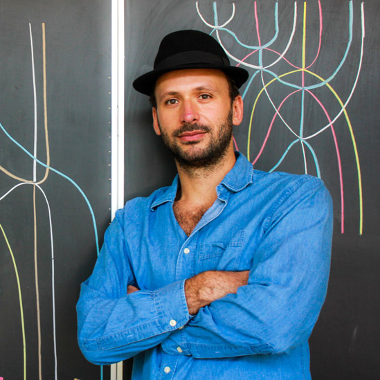
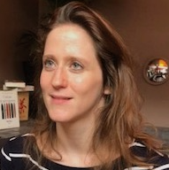

<h4>Matroids, combinatorics, and geometry</h4>

    

        
    

    
    
        

            <a href="http://math.sfsu.edu/federico/">Federico Ardila</a> is a Colombian mathematician and musician interested in the intersection between combinatorics, geometry, and algebra. He received his PhD from MIT and is a professor at San Francisco State University and Universidad de Los Andes. He is a Guest Lecturer at the International Congress of Mathematicians 2022, a Fellow of the American Math Society, and a recipient of the Math Association of America's Teaching Award. He has directed the graduate theses of more than 50 students and co-directs MSRI-UP, a research program for ethnic minority students in the United States. In all aspects of his work, Federico seeks to contribute to building an increasingly inclusive and equitable mathematical community. <em>Photo by May-Li Khoe.</em>
        
   
        
  
            <a href="ardila.html">View mini-course details.</a>
        
   
    

<h4>Cluster algebras and cluster categories via surfaces</h4>

    

        
    

    
    
        

            <a href="http://www1.maths.leeds.ac.uk/~pmtkb/">Karin Baur </a> is a professor in Pure Mathematics at the University of Leeds. After obtaining her PhD in 2002 from the University of Basel in Switzerland she spent her post-doctoral years at ETH, at UCSD and at the University of Leicester before being an SNSF professor at ETH. She became a full professor at the University of Graz in 2011. Her research interests lie in algebraic, combinatorial and geometric methods in representation theory. <em>Photo by Severin Nowacki</em>.
        
   
        
  
            <a href="baur.html">View mini-course details.</a>
        
   
    

<h4>Configurations spaces, algebraic topology and operads</h4>

    

        
    

    
    
        

            <a href="https://idrissi.eu/">Najib Idrissi</a> is a maître de conférences at Université Paris Cité since 2018. He obtained his PhD in mathematics from the Université de Lille in 2017 under the direction of Benoit Fresse and worked as a postdoc at ETH Zurich in 2018 under Thomas Willwacher. He is mainly interested in operads, whether algebraic or topological, and their applications to the computation of invariants of manifolds and their configuration spaces through the theory of graph complexes. In 2020, he was awarded the Peccot <a href="https://idrissi.eu/research/peccot">Lecture</a> and <a href="https://www.college-de-france.fr/site/cours-peccot/guestlecturer-2020-03-04-11h00.htm">Prize</a> by the Collège de France and lectured on the real homotopy type of configuration spaces.
        
   
        
  
            <a href="idrissi.html">View mini-course details.</a>
        
   
    

<h4>An introduction to geometric representation theory for quantum groups</h4>

    

        
    

    
    
        

            <a href="https://www.maths.ed.ac.uk/~djordan/">David Jordan</a>
            is a Reader in the Hodge Institute at the University of Edinburgh School of Mathematics.  He received his PhD from MIT in 2011, followed by an NSF postdoctoral research fellowship at the University of Texas before joining the University of Edinburgh as a Chancellor’s fellow in 2013.  In 2015 he was awarded an ERC Starting Grant to study the <a href="https://cordis.europa.eu/project/id/637618">quantum geometric Langlands topological field theory</a>.  His work centers on quantum topology of 2-, 3-, and 4-dimensional manifolds, combining tools from higher algebra, representation theory of quantum groups, and elements of skein theory.  With his collaborators he has developed the mathematical foundation for the Betti quantum geometric Langlands TFT, a model for the Kapustin–Witten twist of N=4 SUSY Yang–Mills gauge theory.
        
   
        
  
            <a href="jordan.html">View mini-course details.</a>
        
   
    

<h4>Origamics: the Mathematics of Origami</h4>

    

        
    

    
    
        

            <a href="https://www.maths.tcd.ie/~lebed/">Victoria Lebed</a>  finished her PhD in 2012 at Paris City University (formerly Paris 7). After postdocs at Osaka City University, University of Nantes, and Trinity College Dublin, she settled down at the University of Caen Normandy. Her interests revolve around the vast notions of §ucture and braiding, in particular their algebraic, homological, topological, and categorical aspects. This includes the Yang–Baxter equation, braid groups, knots and their generalisations, self-distributivity, shuffle algebras, Hopf algebras. She believes that most of mathematics can (and should!) be drawn. She is actively engaged in outreach activities. <em>Photo by the <a href="https://opc.mfo.de/detail?photo_id=23653">Oberwolfach Photo Collection</a></em>.
        
   
        
  
            <a href="lebed.html">View mini-course details.</a>
        
   
    

<h4>Representation theory and categorification</h4>

    

        
    

    
    
        

            <a href="https://nicolaslibedinsky.cl/about-me/">Nicolás Libedinsky</a> is a Chilean mathematician. He studied in École Normale Supérieure in Paris and then completed his Ph.D. between Paris Diderot University and Oxford University in 2008. He had an Alexander von Humboldt postdoctoral position in Germany and is now a Professor at the Universidad de Chile. His main interest is (modular) representation theory. In 2019 he published a "mathematical novel" called <em>La unidad de todas las cosas</em>. 
        
   
        
  
            <a href="libedinsky.html">View mini-course details.</a>
        
   
    

<h4>Cotangent complexes of moduli spaces and Ginzburg dg algebras</h4>

    

        
    

    
    
        

            <a href="https://wwwde.uni.lu/research/fstm/dmath/people/sarah_scherotzke">Sarah Scherotzke</a>
            did her PhD at the University of Oxford in 2009. After postdoctoral positions in Paris and Bonn, she became professor at the University of Münster and is now professor at the University of Luxembourg. During her PhD, she worked on various topics in representation theory, during her postdoc on cluster theory and she is now working in the field of derived algebraic geometry. Derived geometry gives us a way to keep doing geometry when things go wrong for instance in non-transversal settings. It is a beautiful and quickly developing area of maths, with connections to lots of other fields of mathematics. In her free time, Sarah likes to hike, swim and dance. 
        
   
        
  
            <a href="scherotzke.html">View mini-course details.</a>
        
   
    

<h4>Computational algebra: groups, rings and combinatorics</h4>

    

        
    

    
    
        

            <a href="https://vendramin.github.io/">Leandro Vendramin</a> obtained his Ph.D. in 2010 from Universidad de Buenos Aires. Vendramin's research interests are related to non-commutative algebra. He obtained an Alexander von Humboldt Fellowship and worked as a postdoctoral fellow in the University of Edinburgh.
        
   
        
  
            <a href="vendramin.html">View mini-course details.</a>
        
   
    

