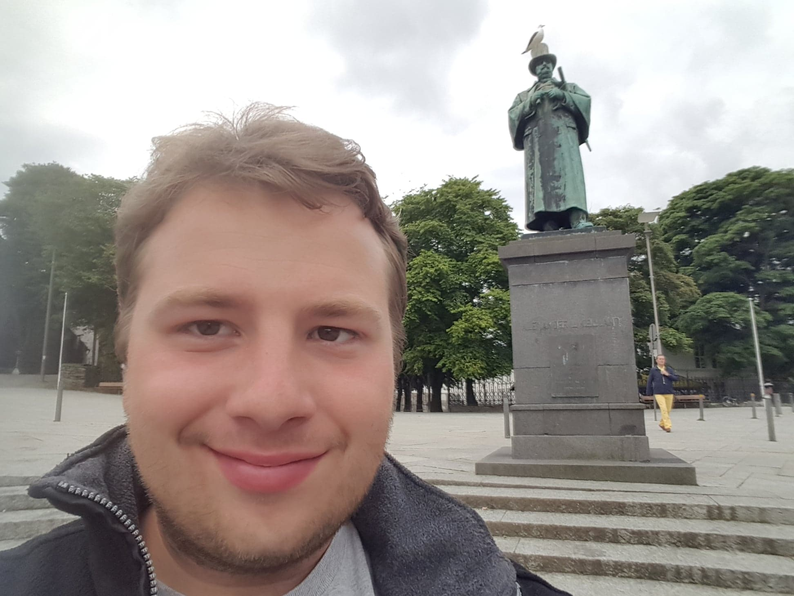

[Leandro Vendramin](https://vendramin.github.io) (Vrije Universiteit Brussel)
_Computational algebra: groups, rings and combinatorics_. We present the computer algebra system GAP and use it to solve some research-level problems in algebra and combinatorics. The topics to investigate are groups, certain finite rings and some combinatorial structures associated with the Yang-Baxter equation (with applications in knot theory).  GAP is a system for computational discrete algebra with emphasis on computational group theory. 

### Assistants ###

[_Arne van Antwerpen_](https://vanantwerpen.github.io/) was the assistant to Leandro Vendramin for this course's tutorials.

Arne is a postdoc at Vrije Universiteit  Brussel (VUB) in Brussels, Belgium. He completed his PhD in 2020 at Vrije Universiteit Brussel under the supervision of Eric Jespers. His research interests include set-theoretic solutions of the Yang-Baxter equation, skew braces, finite group theory and finiteness conditions in ring theory.

 

 

### Installing GAP ###

We strongly recommend that all participants have either SAGE or GAP installed _before_ 
the lectures begin. To install SAGE, which comes with a GAP distribution,
please see [here](https://doc.sagemath.org/html/en/installation/index.html). To install GAP, 
there are general instructions available [here](https://www.gap-system.org/Download/index.html). 
If you would prefer not to install GAP, you can find an online alternative 
[here](https://github.com/gap-system/try-gap-in-jupyter).

### Reading material for the course ###

1. [_Computer algebra with GAP_](vendramin/gap.pdf) by K. Piterman. and L. Vendramin. 

### Slides

1. [First lecture](vendramin/lecture1.pdf).
2. [Second lecture](vendramin/lecture2.pdf).
3. [Third lecture](vendramin/lecture3.pdf).

### Tutorial 

1. The file with the _FRACTRAN_ program _PRIMEGAME_ is [here](vendramin/fractran.g).
2. The file generating the _Look and Say_ sequence is [here](vendramin/lookandsay.g).